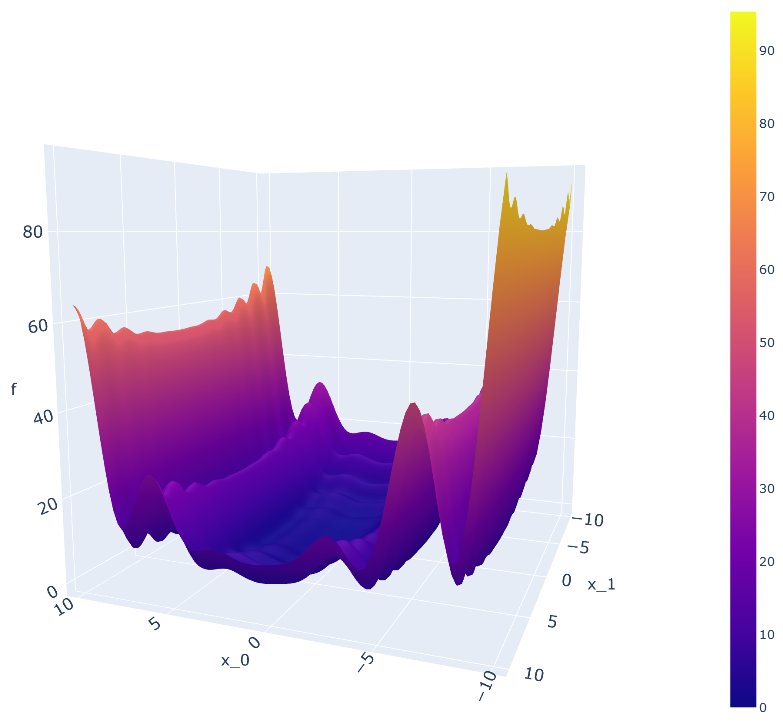
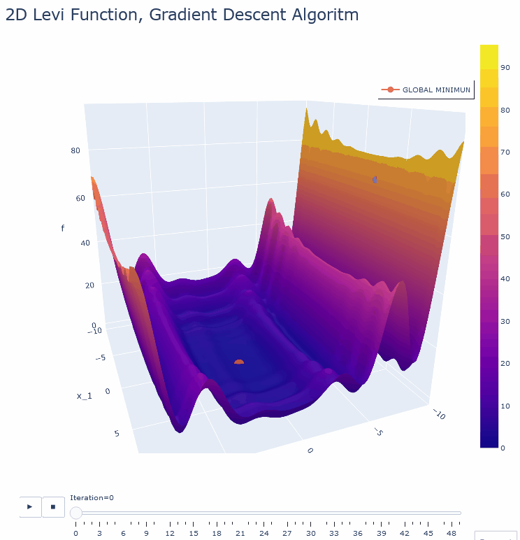

# Genetic algorithms

## Description
This project focuses on the study and evaluation of the performance of genetic algorithms in optimization problems. In addition to making a comparison with the Gradient Descending algorithm.

## Genetic algorithms
Genetic algorithms are a class of search and optimization algorithms inspired by the theory of evolution. They are based on principles such as natural selection, reproduction and mutation to generate and improve solutions to optimization problems. The simple pseudocode is as follows:
```
1. Initialize random population
2. Evaluate the fitness of each individual

As long as the termination criteria is not met:
     1. Select parents by tournament selection
     2. Carry out a cross between the selected parents
     3. Apply mutation to the generated descendants
     4. Assess the fitness of new individuals
     5. Replace the current population with the generated descendants
End of algorithm
```
## Evaluation Function
In this project, we will use the 2D Levy evaluation function to test genetic algorithms. The Levy function is a well-known optimization function that is used as a challenge for optimization algorithms. It is defined as follows:

$$f(x, y) = sin^2(πw_1) + [(w_1 - 1)^2(1 + 10sin^2(πw_1 + 1))] + [(w_2 - 1)^2(1 + sin ^2(2πw_2))]$$
where $w_1 = 1 + \frac{x - 1}{4}$ and $w_2 = 1 + \frac{y - 1}{4}$



Features of the evaluation function:
- Dimension: 2
- Domain: [-10, 10] in both dimensions
- Theoretical minimum: (1, 1) with a value of 0

## Examples of Genetic Algorithms
Below are 2 animated examples of the operation of the algorithms of this project:

### Descending Gradient


### Genetic algorithm


## Results
Below is a table with the results obtained for each algorithm and evaluation function:
| Algorithm             | Parameters   | Minimum Found      |
|-----------------------|-----------------------|--------------------|
| Gradient Decent       | learningRate=0.06, maxIter=50                  |        2.4189      |
| Genetic Algorithm 	| maxIter=50, numParticles=100, chromLength=40, probCross=0.5, probMut=0.2                  |       0.0002       |

## Conclusions
The tests and evaluations carried out demonstrate the superior performance of the genetic algorithms compared to the gradient descent algorithm. Genetic algorithms offer a more robust and efficient solution for the optimization of functions, especially in complex problems with multiple local minima. These results support its utility in biological applications and other research areas.

This project has been an enriching experience to understand and evaluate the operation of genetic algorithms and their applicability in optimization problems!
